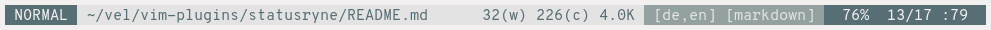
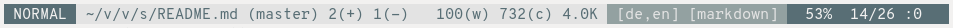
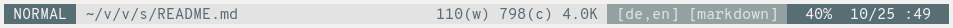
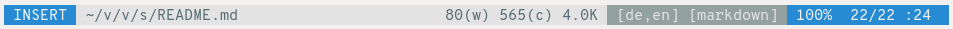

## Ryan's Statusline: Statusryne

A simple satusline and tabline plugin for vim.

#### Satusline







Left side: Mode, filename, git branch, git additions and deletions.

Right side: Word count, character count, file size (as reported by `du`),
spelling language, filetype, percentage through file in lines, line count/ total
line count, cursor column line.

Features:

* *(Filename set dynamically)* Depending on the size available in the terminal,
  first the full path of the file is displayed, else a shortened path is
  displayed, else only the basename is shown.

* *(Colour indicator)* Automatic mode dependent colour switching.

* *(Git information)* Display git branch with insertions and deletions

#### Tabline


Features:

* *(Equal spacing)* Tab widths are set to equal lengths whenever a new buffer is
  opened.

* *(Filetype indicators)* When certain buffers are opened, an additional label
  is added to the buffer name:

  * `[H]` For help buffers
  * `[Q]` For quickfix windows
  * `[New]` For new buffers with no name yet

* *(Display all open buffers in window)* If a window has two open (visible)
  buffers in it, for example in a vertical split, both buffer names will be
  displayed. If a tab is open on two open buffers, the active buffer will be
  highlighted in a darker colour.

#### Colours

I am using Ethan Schoonover's light solarized colour scheme with a slight
modification of the base colour. This is done by setting the colours in the
terminal emulator (`alacritty` in my case) explicitly, and then using relative
labels in the plugin. Below are explicit RGB values in the `alacritty`
configuration format

```
colors:
  primary:
    background: '0xf2f1f0' # Original: 0xfdf6e3
    foreground: '0x657b83'

  normal:
    black:   '0x073642'
    red:     '0xd54e53'
    green:   '0x859900'
    yellow:  '0xb58900'
    blue:    '0x268bd2'
    magenta: '0xd33682'
    cyan:    '0x2aa198'
    white:   '0xe3e3e3' # Original: 0xeee8d5

  bright:
    black:   '0x002b36'
    red:     '0xdc322f'
    green:   '0x586e75'
    yellow:  '0x657b83'
    blue:    '0x839496'
    magenta: '0x6c71c4'
    cyan:    '0x93a1a1'
    white:   '0xf2f1f0' # Original: 0xfdf6e3
```
